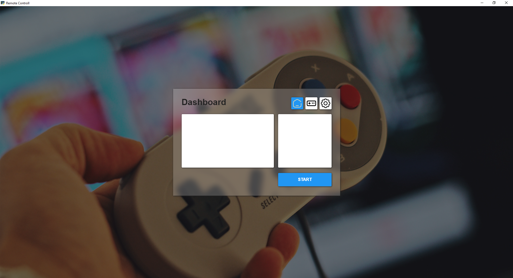
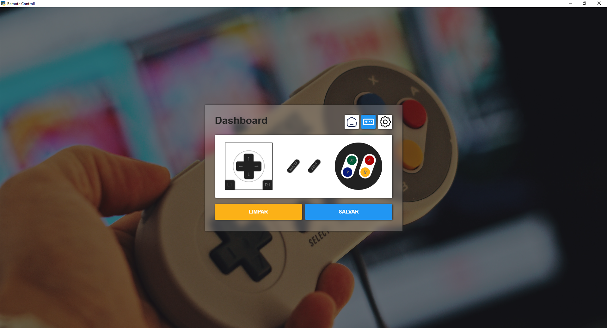
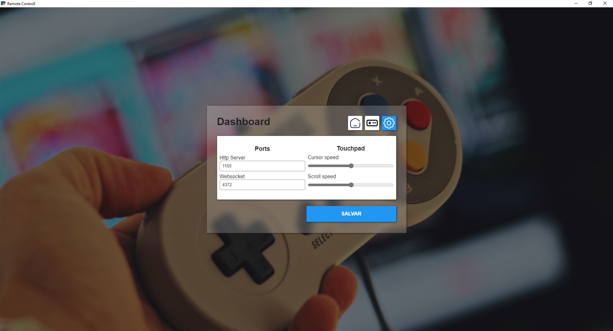
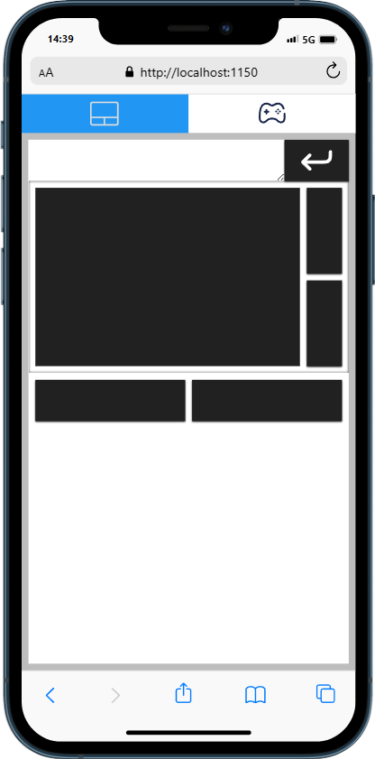
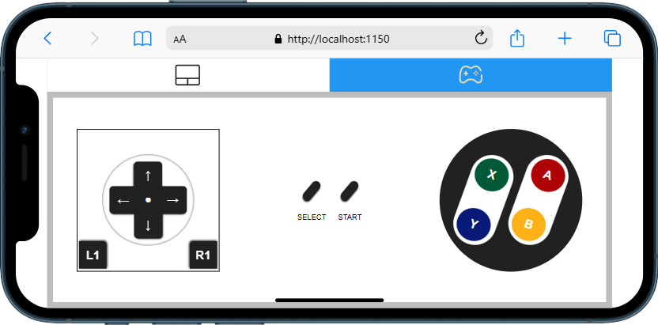

<h1>Remote Control</h1>

Controle o seu dispositivo a distância com o poder do <a href="https://www.python.org/">python</a> e <a herf="https://developer.mozilla.org/pt-BR/docs/web/javascript/guide/introduction">javascript</a>.

<ul>
    <li><a href="#about">Sobre</a></li>
    <li><a href="#requirements">Requisitos</a></li>
    <li><a href="#installation">Instalação</a></li>
    <li><a href="#images">Imagens</a></li>    
</ul>

<h3 id="about">Sobre</h3>

    Remote control é um software desenvolvido com intuito de aprendizado. Basicamente, ele permite controlar um dispositivo usando duas partes: cliente, que é responsavel por enviar os comandos e servidor que responsavel por tratar e realizar esses comandos.
    Na criação desse programa foi utilizada a linguaguem python no backend e javascript, html, css no front e API REST para realizar a comunicação entre as duas.

<h3 id="requirements">Requisitos</h3>

Sistema Operacional:
    O sistema foi desenvolvido e testado exclusivamente para operar no ambiente Windows. Não foram realizados testes em outros sistemas operacionais.

Dispositivo:
    O sistema requer um dispositivo com acesso a um navegador web compatível. Recomenda-se o uso de navegadores que ofereçam suporte a ECMAScript (JavaScript), como Chrome, Firefox ou Edge.

Conectividade com a Internet:
    Para utilizar o sistema, é essencial ter acesso à internet.

Linguagem de Programação:
    O backend do sistema é desenvolvido utilizando a linguagem de programação <a href="https://www.python.org/">Python</a>. 

<h3 id="installation">Instalação</h3>

Instalação do Python:
    Caso ainda não tenha o Python instalado, é necessário realizar o download e a instalação. Acesse este <a href="https://www.python.org/">link</a> para obter o instalador adequado ao seu sistema operacional. Siga as instruções fornecidas durante a instalação.

Configuração do Ambiente:
    Com o Python instalado, abra o terminal e navegue até a pasta do projeto, utilizando o comando cd caminho/para/a/pasta/do/projeto.
    ex: Projeto estivar na pasta downloads: cd Downloads/Remote Control

Instalação de Dependências:
    Execute o seguinte comando para instalar as dependências do projeto: python -m pip install -r requirements.txt

Após a conclusão da instalação das dependências, execute o programa com o seguinte comando: python main.py

<h3 id="images">Imagens</h3>

